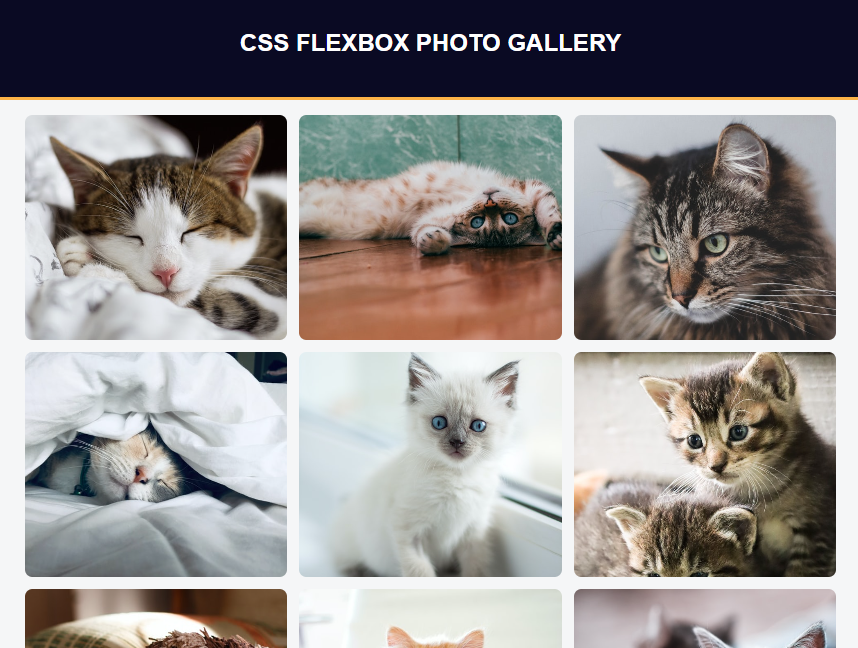

# Flexbox - Photo Gallery 

🔗 [Click here to access](https://carvmi.github.io/flexbox/)
## Technologies 
- HTML
- CSS

## What I have learned
- Reset box model by adding a * or html rule selector to the CSS file with the box-sizing property set to border-box;
- Put div elements of class gallery inline when using display property set to flex;
- Adjust flex with properties like flex-direction and flex-wrap (other examples include flex-basis, flex-flow, flex-grow and flex-shrink);
- Flex-basis acts similar with width property;
- The object-fit property set to cover means the image will be clipped to fit the given dimension;
- the content property is used with the ::before and ::after pseudo-elements, to insert generated content.

## Contact
milenadecarvalho2000@gmail.com
